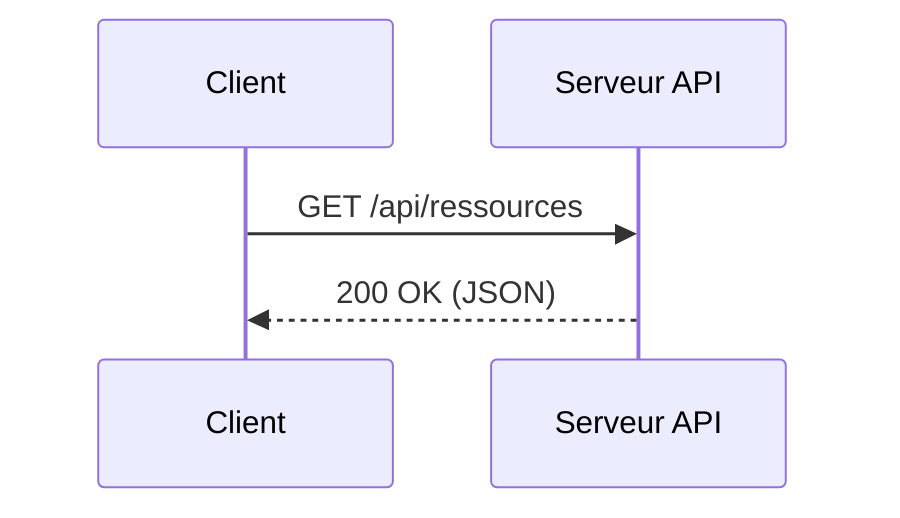
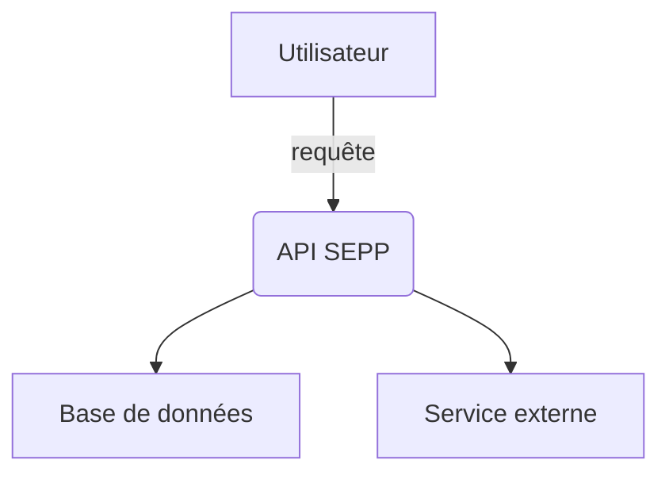

Vous pouvez créer des schémas directement dans vos documents avec Mermaid.

```mermaid
sequenceDiagram
  participant C as Client
  participant S as Serveur API
  C->>S: GET /api/ressources
  S-->>C: 200 OK (JSON)
```

```mermaid
graph TD
  A[Utilisateur] -->|requête| B(API SEPP)
  B --> C[Base de données]
  B --> D[Service externe]
```
